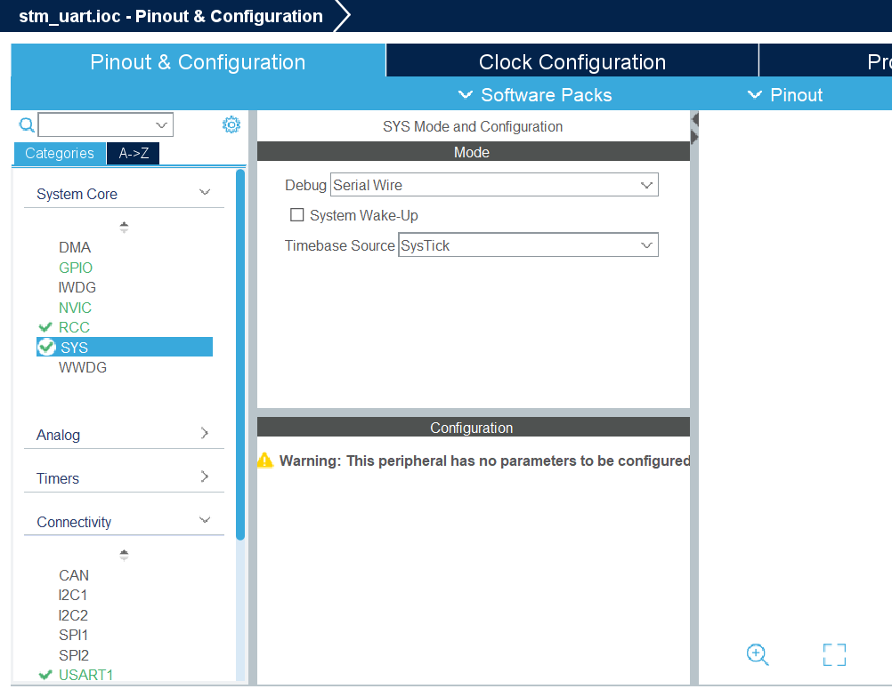
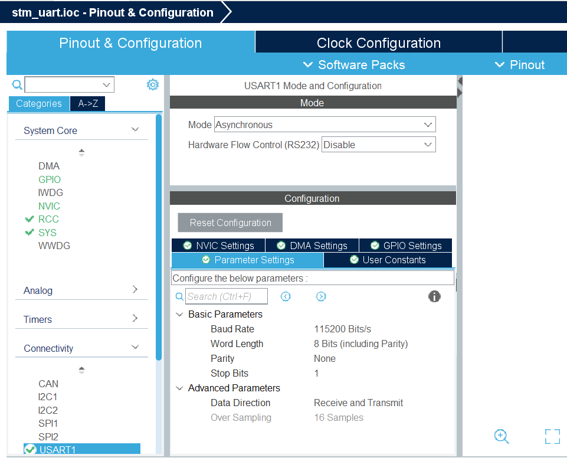
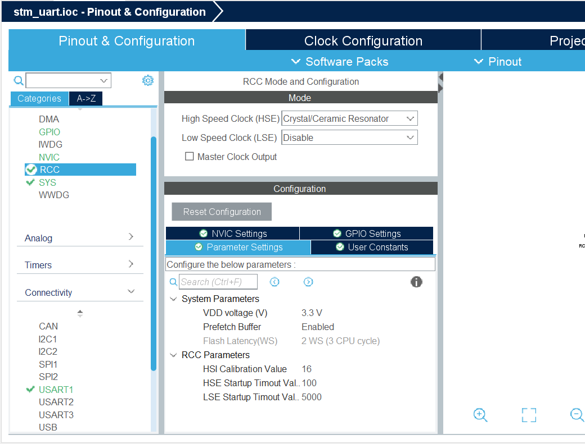
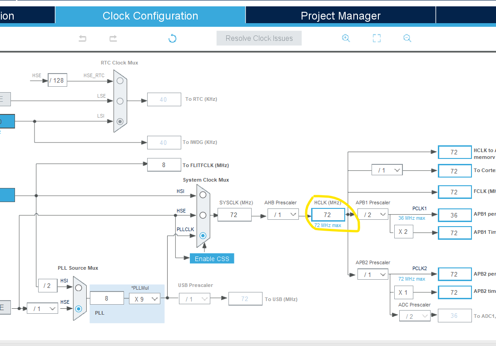

## **STMCube IDE**


```
/
  ├── SYS
  |   ├──Debug──Serial Wire
  |   └──Timebase Source──Sys Tick
  |
  ├── Connectivity
  |     └── USART1
  |          └──Mode──Asyncronous    
  └── RCC
        └──High Speed Clock
                    └──Crystal Ceremic Resonator 

```
<br>
<br>

## Pictures :
# 1


# 2


# 3


# 4



